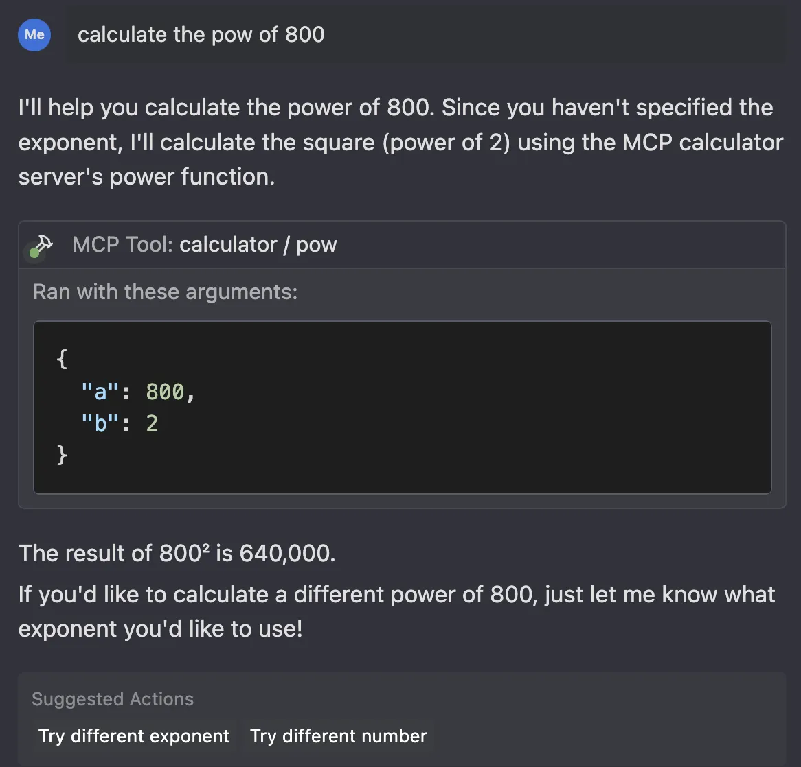

# How to build an MCP server - Calculator Example

[](https://smithery.ai/server/@simonberner/mcp-server-calculator)

## About

Model Context Protocol (MCP) is a protocol that enables LLMs to access custom tools and services. An MCP client can make requests to MCP servers to access tools that they provide. This example represents a simple calculator server that provides basic math operations to a client.

> "MCP can provide a single, standardized way for AI models to interact with external systems. You write code once and all AI systems can use it." [1](#resources)

> "Servers are the fundamental building block that enriches LLMs with external data and context." [2](#resources)



## Tech Stack

- Python3
- Pytest
- MCP SDK
- MCP CLI
- Nix

## How to setup and use

As we are using Nix in this project for having a reproducible and isolated development environment, there is no need to install Python or any other dependencies. You will get everything you need out of the box. Also there is no need to create a virtual environment in Python using `venv` or `poetry`, but you have to be willing to install Nix on your system.

- Install [direnv](https://github.com/direnv/direnv) (used to load the development environment)
- Install [Lix](https://lix.systems/install/)
- Clone this repository
- cd into the directory
- Run `direnv allow`
- Run `pytest`

### Installing via Smithery

To install mcp-server-calculator for Claude Desktop automatically via [Smithery](https://smithery.ai/server/@simonberner/mcp-server-calculator):

```bash
npx -y @smithery/cli install @simonberner/mcp-server-calculator --client claude
```

### Alternative

If you don't want to setup and use Nix, you can of course also use [uv](https://docs.astral.sh/uv/) to build the package/project. Here is some guidance:

```shell
# Install uv (see https://docs.astral.sh/uv/getting-started/installation/)
curl -LsSf https://astral.sh/uv/install.sh | sh

# Create a virtual environment named .venv
uv venv

# Activate the virtual environment (example for bash/zsh)
source .venv/bin/activate

# Now run the install or build commands
uv pip install -e .
# or
uv pip wheel . -w dist
```

### Running & Testing the Server locally

- [MCP Inspector](https://modelcontextprotocol.io/docs/tools/inspector) is a handy GUI tool that lets you test your custom MCP server via web interface at http://localhost:5173 without integrating it with LLM / AI agents.

```shell
mcp dev src/mcp_server_calculator/calculator.py
```

### Host/Client integration

- Add the following to your mcp config:

```json
{
  "mcpServers": {
    "calculator": {
      "command": "python",
      "args": [
        "<YOUR-PATH>/mcp-server-calculator/src/mcp_server_calculator/calculator.py"
      ]
    }
  }
}
```

### Notes

- When using [Windsurf IDE](https://codeium.com/windsurf) as MCP Host, you need to have a [Pro Plan](https://codeium.com/pricing) to be able to use Cascade (as MCP Client) with MCP Servers.

## Issues

Check [Issues](https://github.com/simonberner/mcp-server-calculator/issues) for seeing the current issues or for opening a new one.

## Resources

- [1] [MCP server: A step-by-step guide to building from scratch](https://composio.dev/blog/mcp-server-step-by-step-guide-to-building-from-scrtch/)
- [2] [What is Model Context Protocol (MCP)?](https://composio.dev/blog/what-is-model-context-protocol-mcp-explained/)
- [Understanding MCP and how AI engineers can leverage it](https://dev.to/luxdevhq/understanding-mcp-and-how-ai-engineers-can-leverage-it-3e2i`)
- [MCP SDK](https://pypi.org/project/mcp/)
- [MCP CLI](https://pypi.org/project/mcp-cli/)
- [MCP Inspector](https://github.com/modelcontextprotocol/inspector)
- [The largest collection of MCP Servers](https://mcp.so/)
- [A Beginner's Guide to using MCP](https://youtu.be/Y_kaQmhGmZk)
- [Claude MCP has Changed AI Forever - Here's What You NEED to Know](https://www.youtube.com/watch?v=v_6EXt6T83I)
- [Find MCP servers](https://windsurf.run/mcp)
- [Build your first MCP server with TypeScript in under 10 minutes](https://hackteam.io/blog/build-your-first-mcp-server-with-typescript-in-under-10-minutes/)
- [Model Context Protocol (MCP) Introduction](https://modelcontextprotocol.io/introduction)

## Credits

- Nix-Setup taken from [ical2json](https://github.com/CodersOnlyCH/ical2json)

## Nice things to know

### Nix

- [Why using Nix?](https://nixos.org/)
- [Why using Lix?](https://lix.systems/about/#why-lix)
- [Nix packages](https://search.nixos.org/packages)
- [nix-shell](https://nix.dev/manual/nix/2.26/command-ref/nix-shell.html)
